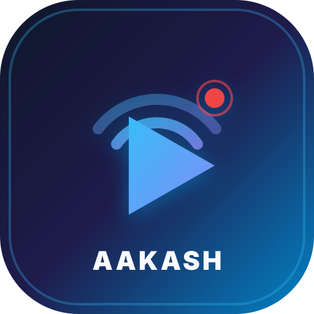
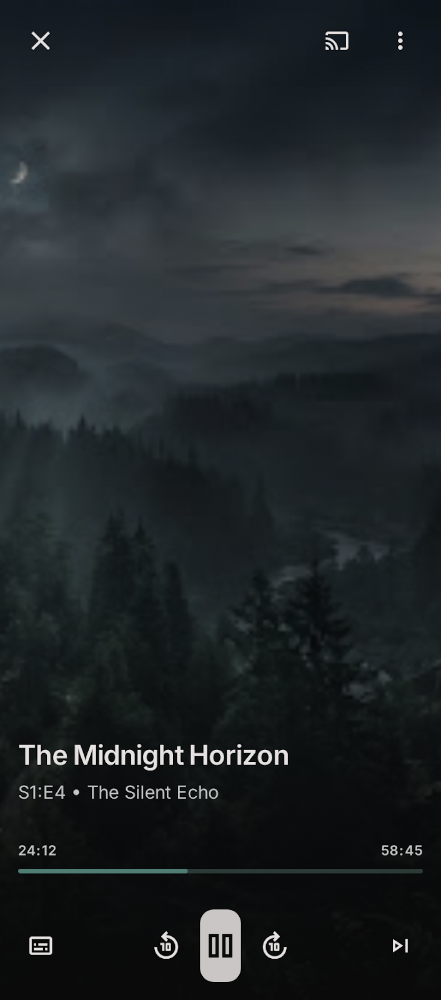
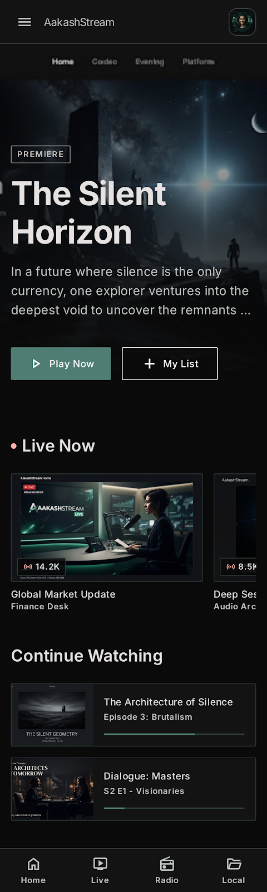
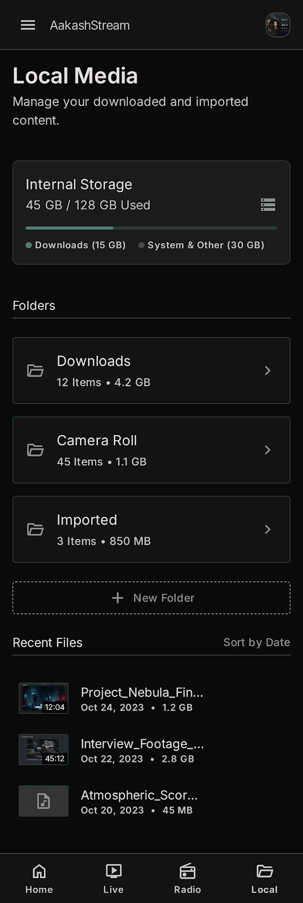
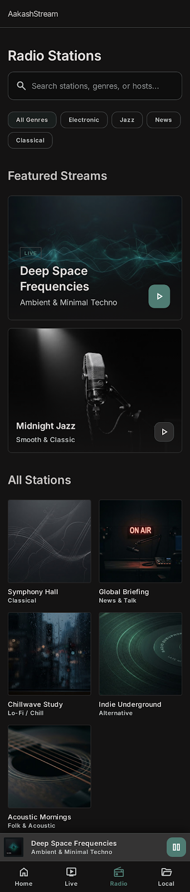
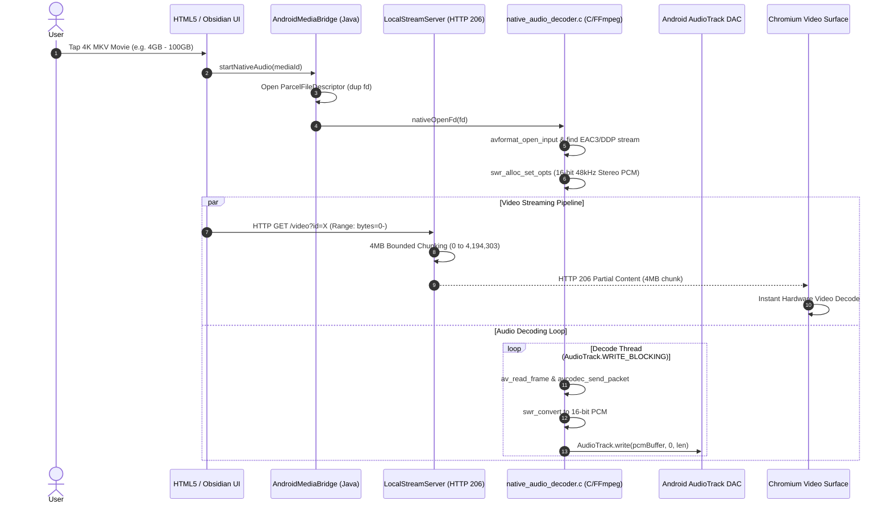
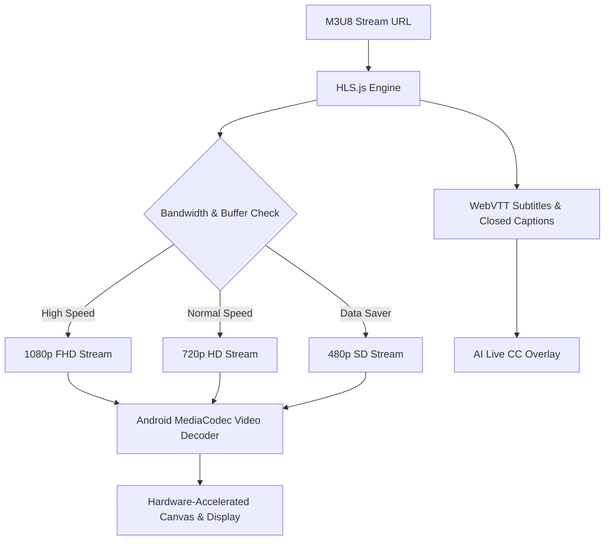
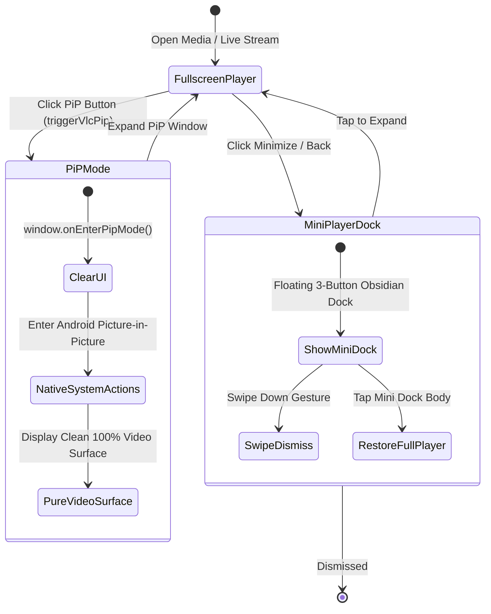
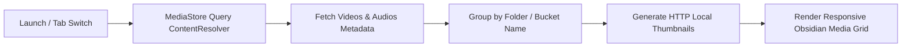
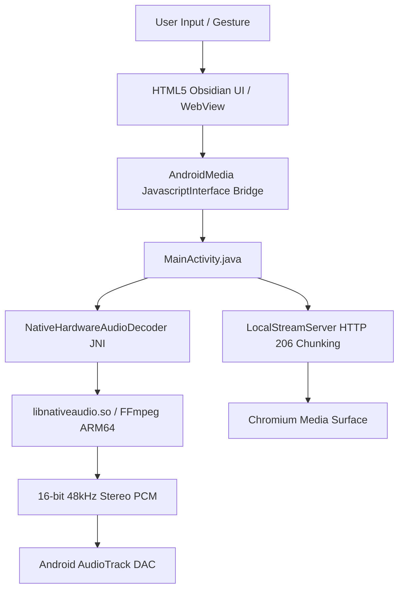

# 📺 T2L (Television to Live) • Ultra HD Streaming & Media Player

<div align="center">



### **The Next-Generation Android Media Player, Live TV Hub & Radio Engine**

[-brightgreen.svg?style=for-the-badge&logo=android)](https://www.android.com/)
[](https://developer.android.com/ndk)
[](https://ffmpeg.org/)
[](https://github.com/)
[](LICENSE)

</div>

---

## 📸 Visual Showcase & User Interface

<div align="center">

| 🎬 **Cinematic Media Player** | 🏠 **Live TV & IPTV Overview** |
| :---: | :---: |
|  |  |

| 📂 **Local Device Media Library** | 📻 **All India Radio & FM Hub** |
| :---: | :---: |
|  |  |

</div>

---

## 📖 Overview

**T2L (Television to Live)** is a high-performance, cinematic media player and IPTV/Radio streaming application engineered specifically for Android devices. Combining a native **ARM64 C / FFmpeg Dolby DDP5.1 / EAC3 decoding engine** with a hardware-accelerated **VLC-style user interface**, T2L provides instant playback of local 4K SDR/HDR MKV movies (up to 100 GB+) along with over **870+ Live TV Channels and All India Radio / FM stations**.

---

## ✨ Key Features

### 🔊 1. Native FFmpeg Dolby DDP 5.1 / EAC3 Hardware Audio Engine
- **Direct C / JNI Decoder (`native_audio_decoder.c`)**: Decodes complex multi-channel Dolby Digital Plus (EAC3), AC3, DTS, and AAC audio streams from local file descriptors in real time.
- **Hardware-Clocked DAC Pacing**: Streams decoded 16-bit 48,000 Hz stereo PCM audio directly into Android `AudioTrack` with `WRITE_BLOCKING` for zero jitter, zero stutter, and zero audio delay.
- **Scoped Storage Bypass**: Uses `dup(fd)` on `ParcelFileDescriptor` to seamlessly access external drives, SD cards, and USB OTG without Android permission bottlenecks.

### ⚡ 2. Instant Playback for 100 GB+ Files (4MB HTTP 206 Slicing)
- **Local Streaming Server**: Built-in multi-threaded HTTP server with `BufferedInputStream` and `BufferedOutputStream`.
- **4MB Partial Content Chunking**: Slices open-ended range requests (`bytes=0-`) into lightweight 4 MB chunks, allowing Chromium and Android media parsers to read MKV cluster headers and begin 4K movie playback with minimal startup latency, even on 100 GB+ files.

### 📱 3. Instant Picture-in-Picture (PiP) & Floating Mini Player
- **0ms Instant UI Clearance**: Automatically hides top bars, seekbars, menus, and HUDs before entering PiP mode to provide a 100% clean video window.
- **Android System PiP RemoteActions**: Native system controls on the PiP overlay:
  - **⏮️ Previous Channel / Video**
  - **⏯️ Play / Pause**
  - **⏭️ Next Channel / Video**
- **Docked Mini Player**: Floating obsidian dock with clean 3-button controls and a downward swipe-to-dismiss gesture.

### 🎛️ 4. VLC-Inspired Professional Player Controls
- **Subtitles & Multi-Track Selection**: Switch audio tracks and closed captions on the fly.
- **Aspect Ratio Control**: Toggle between Original, 16:9, 4:3, Fill, and Zoom with a single tap.
- **A-B Repeat Loop**: Set Point A and Point B to loop specific video segments seamlessly.
- **Gesture HUD**:
  - **Left Side Swipe**: Screen Brightness control (0% to 100%)
  - **Right Side Swipe**: System Media Volume control (0% to 100%)
  - **Horizontal Swipe**: Fast Seek / Scrubbing (±10s) with visual ripple feedback
  - **Double-Tap**: Quick 10s forward / rewind jump
- **Screen Wake & Orientation Lock**: Keep screen active during movies and toggle Portrait / Landscape / Full Sensor.

### 🌐 5. 870+ Live Hindi TV Channels & FM Radio
- **Comprehensive Coverage**: Hindi News, Entertainment, Movies, Kids (Disney, Nickelodeon dubbed), Sports, Music, Lifestyle, and Religious streams.
- **Live Radio**: All India Radio (AIR), Vividh Bharati, and regional FM stations.
- **Smart Features**: Adaptive HLS bitrate selection (Auto / 1080p / 720p / 480p), Low-Latency live mode, channel favorites, and recent history.

---

## 🔄 System Workflows

### 🎬 Workflow 1: 4K Movie & Dolby EAC3 Native Streaming Architecture


---

### 📡 Workflow 2: Live HLS Stream Ingestion & Adaptive Playback


---

### 🔲 Workflow 3: Picture-in-Picture (PiP) & Mini Player State Lifecycle


---

### 📂 Workflow 4: Device Media Scanner & Local Folder Indexing


---

## 🏗️ Architecture & Technology Stack



| Component | Technology / Library | Description |
| :--- | :--- | :--- |
| **Operating System** | Android 7.0+ (API 24 to API 35) | Supports phones, tablets, and Android TV |
| **Native Engine** | C99, Android NDK r27, FFmpeg 7.x | ARM64-v8a EAC3/DDP5.1 audio decoding |
| **Audio Output** | Android `AudioTrack` (STREAM_MUSIC) | Hardware 48 kHz stereo PCM streaming |
| **Local Server** | Java `ServerSocket` + `FileChannel` | 4MB HTTP 206 partial content range slicer |
| **Frontend UI** | HTML5, CSS3 Glassmorphism, Vanilla JS | 60 FPS hardware-accelerated VLC player UI |
| **Streaming** | HLS.js + Android MediaCodec | Adaptive bitrate live stream pipeline |

---

## 🚀 Building & Installing

### Prerequisites
1. **Android SDK** (Build-Tools 35.0.0, Platform API 35)
2. **Android NDK** (r27 or later for ARM64 compilation)
3. **Java JDK** (OpenJDK 17 or 21)
4. **Python 3** (with Pillow for icon generation)
5. **ADB** connected to an Android device or emulator

### 1. Clone Repository
```bash
git clone https://github.com/Abhiboss07/HindiIPTVValidator.git
cd HindiIPTVValidator
```

### 2. Build the APK
Run the automated build script:
```bash
cp -rf index.html assets data android_app/src/main/assets/
./build_apk.sh
```

### 3. Install on Connected Device
```bash
adb install -r T2L.apk
adb shell am start -n com.aakashstream.app/.MainActivity
```

---

## 📂 Project Structure

```text
├── android_app/
│   ├── jni/
│   │   ├── native_audio_decoder.c     # Native FFmpeg C JNI Audio Engine
│   │   └── Android.mk                 # NDK Build Rules
│   ├── src/main/
│   │   ├── AndroidManifest.xml        # PiP, Scoped Storage & Sensor Config
│   │   ├── java/com/aakashstream/app/
│   │   │   └── MainActivity.java      # Java Bridge, HTTP Server & PiP Actions
│   │   ├── jniLibs/arm64-v8a/         # Compiled FFmpeg .so Libraries
│   │   │   ├── libavcodec.so
│   │   │   ├── libavformat.so
│   │   │   ├── libavutil.so
│   │   │   ├── libswresample.so
│   │   │   └── libnativeaudio.so
│   │   ├── res/                       # Multi-density T2L launcher icons
│   │   └── assets/                    # Bundled Web Application
├── assets/
│   ├── app.js                         # Core Application Controller & VLC Player
│   ├── styles.css                     # Obsidian Glassmorphic Design System
│   ├── hls.min.js                     # HLS.js Live Streaming Library
│   └── icons/                         # Vector SVG and Master Icons
├── docs/
│   └── screenshots/                   # High-Resolution UI Screenshots
├── data/
│   └── channels.json                  # 870+ Verified TV & Radio Channels Database
├── build_apk.sh                       # Automated APK Compilation Script
└── README.md                          # Project Documentation
```

---

## 🎮 Touch & Gesture Controls

| Gesture | Location | Action |
| :--- | :--- | :--- |
| **Vertical Drag** | Left 40% of screen | Adjust Screen Brightness (0% – 100%) |
| **Vertical Drag** | Right 40% of screen | Adjust Media Volume (0% – 100%) |
| **Horizontal Swipe**| Center of screen | Fast Seek / Scrubbing with HUD pill feedback |
| **Double Tap** | Left / Right side | Quick 10-second Jump Rewind / Forward |
| **Swipe Down** | Floating Mini Player | Dismiss running media |
| **Single Tap** | Center Video Surface | Toggle VLC Controls Overlay (Auto-hide in 3s) |

---

## 🛡️ License

This project is licensed under the **MIT License** - see the [LICENSE](LICENSE) file for details.

---

<div align="center">
  <b>T2L • Television to Live</b><br>
  <i>Built for high-definition streaming and cinema-grade playback.</i>
</div>
